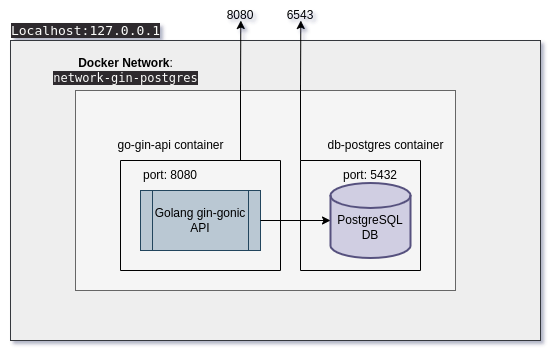

# padel-field

> :bulb: dependencies are vulnerable.

## **Setup** - Windows 10
1. Download [Docker](https://runnable.com/docker/install-docker-on-windows-10) for windows
2. Once installed, open a `cmd` terminal and type `docker --version`
3. The output will be something like:
```bash
Docker version 20.10.17, build 100c701
```
4. If you can see that version message, docker has successfully installed.
5. Install [Makefile](https://stackoverflow.com/questions/2532234/how-to-run-a-makefile-in-windows) for windows. \
*Note this stackoverflow post has also a comment for doing it in visual studio*
---
# Network Topology
Before starting to run the app, is truly important to understand the entire docker network topology in order to be able to 
interact with this system. \
This diagram will be useful: 



You will notice that the ports exported to the "outside" (or, your local system) are `8080` and `6543`. \
This explains everything so lets start.

--- 
# Run the app
Be sure to run both `4` and `6` steps in **different** terminals.
1. Open a `cmd` terminal
2. cd to `/padel-field/`
3. `make start-env` starts the environment (network)
4. `make start-api` starts the api
5. Open a second `cmd` terminal
5. `make start-db` starts the db
6. go to ---> **`http://localhost:8080`** and you will see the api running.
7. `npm start /padel-field/ui` start the react ui

### Extra notes:
- You can kill the running containers with `CTRL + C` instead of using docker commands.
- Is **NOT necessary** to do `make start env` twice, once you did it the first time, then the docker network will live in your system.
- You can see in both terminals the behavior of each component (api and db).
- run a `make help` if you don't remember any command and an output like the follow will pop up:
```go
build-api          build the api docker image
clean-images       deletes all renewable artifacts, for build and install
help               Print the list of makefile targets
start-api          start the api
start-db           start the db
start-env          start the network
test-local         run unit tests on local system (not container) - no tests at the moment
```

# Stop the app
1. `docker kill db-postgres`
2. `docker kill go-gin-api`

### Clean docker images (not recommended)
```bash
make clean images
```
